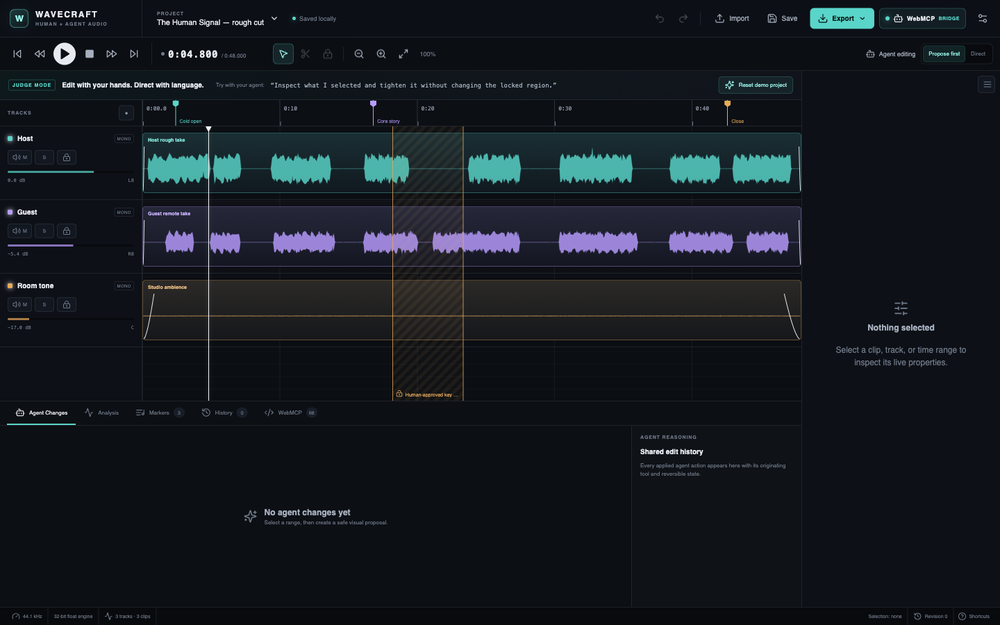
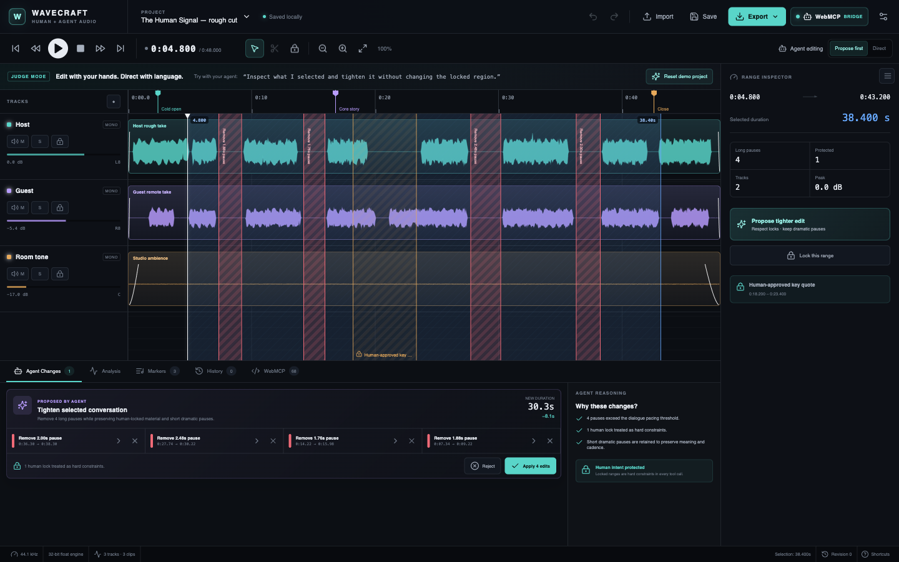

# Wavecraft

> The audio editor built for you and your agent.

[**Open the live editor**](https://wavecraft-webmcp.vercel.app) · [Judge testing guide](./JUDGE_TESTING.md) · [Submission copy](./SUBMISSION.md) · [Demo script](./DEMO_SCRIPT.md)



Wavecraft is a browser-based multitrack audio editor where a human and an external AI agent share one live project. The human works visually with waveforms, clips, selections, locks, and direct manipulation. The agent works through 68 structured WebMCP tools over the same deterministic state.

This is not a chatbot placed beside an editor. The editor itself is agent-native.

## Why WebMCP

Traditional browser automation makes an agent inspect pixels, infer the meaning of controls, click coordinates, and hope the underlying edit matches its intent. That is especially fragile in dense, time-based software.

Wavecraft exposes the concepts that matter directly:

- `inspect_selection` resolves “this” to the exact human-selected range or object IDs.
- `get_current_constraints` makes human locks and manual overrides explicit.
- Editing tools operate on stable track and clip IDs with validated timestamps.
- Significant changes become visible proposals before audio is mutated.
- Structured errors such as `LOCKED_REGION` tell an agent how to re-plan.
- Every accepted agent edit updates the same waveform and reversible history the human sees.

The result is a collaboration loop that pixel clicking cannot provide reliably:

```text
human selection → agent inspection → local analysis → visual proposal
→ human accepts/rejects individual edits → atomic apply → shared history
```

## Flagship workflow

1. Open the live app; the original three-track demo loads immediately.
2. The default 38.4-second dialogue selection already contains one amber, human-locked quote.
3. Ask an external agent: **“Inspect what I selected and tighten it without changing the locked region.”**
4. The agent calls `inspect_selection`, `detect_long_pauses`, and `create_tighten_proposal`.
5. Four red removal diffs appear over the real waveform. The locked dramatic pause is preserved.
6. Reject one individual removal, then apply the other three.
7. All tracks ripple together, the selection and lock move with their audio, and one undo checkpoint is created.



## What is real

- Original procedural PCM for the demo is generated locally from deterministic oscillators, envelopes, noise, and room tone. No commercial or third-party audio is included.
- Web Audio API schedules the edited clips for actual multitrack playback.
- Waveforms are derived from the PCM source buffers, not decorative SVGs.
- Split, trim, move, gain, pan, fades, mute/solo, clip deletion, and synchronized ripple deletion modify a non-destructive edit graph.
- WAV export renders the current graph, including cuts, track/clip gain, pan, mute/solo, speed, and fades.
- Peak, RMS, dynamic range, clipped-source samples, and dialogue-bus pauses are calculated locally from the PCM.
- Undo/redo stores complete project checkpoints; agent proposal application is atomic.
- Project metadata serializes to JSON and generated-demo edits autosave to local storage.

## Human + agent collaboration

### Selection is context

The page exposes the exact live selection. The user never needs to transcribe a timestamp for “tighten this.”

### Locks are intent

Range and track locks are hard constraints. They override Direct mode and are validated both when a proposal is created and again when it is applied.

### Proposals are visual diffs

Destructive changes default to **Propose first**. Proposed removals appear as red overlays; duration impact and action count are visible before mutation. Individual actions can be rejected or restored.

### Manual changes are authoritative

Human gain changes increment `manualRevision`. Later balance proposals preserve that value and adjust surrounding tracks instead.

### Agent work is inspectable

The Agent Changes panel records the originating tool, explanation, affected objects, proposal ID, timestamp, and reversibility. The WebMCP panel shows registered tool count and recent calls.

## Key editor features

- Three-track judge demo with Host, Guest, and Room Tone
- Real waveform rendering and multitrack playback
- Time-range, clip, track, and marker selections
- Stable project/track/clip/marker/lock/proposal IDs
- Split, trim start/end, move, delete, gain, pan, mute, solo, fade in/out
- Synchronized ripple delete across all tracks
- Human locks and protected regions
- Markers and named locked region
- Undo/redo and local demo autosave
- PCM-derived peak/RMS/dynamic-range/clipping/pause analysis
- WAV full-mix or selected-range export
- Project JSON export
- Browser audio import for formats supported by `decodeAudioData`
- Keyboard access: Space, Cmd/Ctrl+Z, Cmd/Ctrl+Shift+Z, Delete, S, L
- Reduced-motion support, visible focus, labels, tooltips, and high-contrast dark UI

## WebMCP implementation

Wavecraft uses the current imperative API on `document.modelContext`:

```ts
await document.modelContext.registerTool(
  {
    name: 'inspect_selection',
    description: 'Use whenever the user says “this”, “selected”, or refers to a visual choice…',
    inputSchema: { type: 'object', properties: {}, additionalProperties: false },
    annotations: { readOnlyHint: true },
    execute: async () => ({ success: true, selection: inspectLiveSelection() }),
  },
  { signal: registrationController.signal },
)
```

Native WebMCP is feature-detected first. In ordinary browsers, the MIT-licensed `@mcp-b/webmcp-polyfill` provides the same local API for development and tool-surface inspection. Tool registrations use one `AbortSignal` lifecycle and return structured objects rather than success strings.

The implementation follows the current [WebMCP Community Group draft](https://webmachinelearning.github.io/webmcp/) and the challenge’s documented canonical `document.modelContext.registerTool(...)` surface.

### Tool catalog

| Category | Count | Representative tools |
|---|---:|---|
| Capabilities and live context | 11 | `inspect_context`, `inspect_project`, `inspect_selection`, `get_current_constraints` |
| Playback and timeline view | 10 | `play`, `pause`, `set_playhead`, `zoom_to_selection` |
| Selection | 5 | `select_time_range`, `select_clip`, `select_track`, `select_marker` |
| Editing, locks, and markers | 21 | `split_clip`, `trim_clip_start`, `fade_clip_out`, `ripple_delete_time_range`, `lock_time_range` |
| Analysis | 5 | `analyze_project`, `detect_long_pauses`, `detect_clipping`, `compare_track_levels` |
| Visual proposals | 9 | `create_tighten_proposal`, `reject_proposal_action`, `apply_proposal` |
| Atomic edit plans | 3 | `validate_edit_plan`, `simulate_edit_plan`, `execute_edit_plan` |
| History and export | 4 | `undo`, `redo`, `get_export_options`, `export_project_json` |
| **Total** | **68** | Every tool has a JSON input schema and structured result/error |

The complete definitions are in [`src/webmcp/tools.ts`](./src/webmcp/tools.ts); lifecycle setup is in [`src/webmcp/registry.ts`](./src/webmcp/registry.ts).

## Architecture

```text
React editor UI ───────┐
                      ├── Zustand live store ── deterministic Project graph
WebMCP tool handlers ─┘           │
                                  ├── pure validated project actions
                                  ├── proposal + lock engine
                                  ├── history / local persistence
                                  ├── PCM source repository
                                  ├── Web Audio playback
                                  └── WAV render + local analysis
```

Both callers use the same `dispatch`, proposal, inspection, and validation paths. There is no shadow “agent state” and no DOM scraping adapter. See [ARCHITECTURE.md](./ARCHITECTURE.md) for invariants and data flow.

## Running locally

Requirements: Node.js 20+ and npm.

```bash
git clone https://github.com/lazyperspective/wavecraft.git
cd wavecraft
npm install
npm run dev
```

Open `http://localhost:4173`.

Production checks:

```bash
npm run lint
npm test
npm run build
npm audit --omit=dev
```

## Testing WebMCP

- ChatGPT’s in-app browser supports WebMCP for challenge testing.
- In compatible Chrome builds, enable `chrome://flags/#enable-webmcp-testing` as directed by the [official challenge page](https://webmcp.devpost.com/).
- Open the live URL and use the prompts in [JUDGE_TESTING.md](./JUDGE_TESTING.md).
- In a development browser, the WebMCP panel confirms all 68 registrations and recent calls.

The automated suite verifies:

- every registration has a unique spec-valid name, object schema, useful description, executable handler, and structured result/error;
- split, trim, fade, ripple synchronization, lock enforcement, proposals, atomic apply, undo state, and human overrides;
- the complete external-agent workflow from context inspection through final state inspection.

## Hackathon notes

Wavecraft was created during the OpenAI WebMCP Challenge submission period. The current official requirements and judging criteria were re-checked on August 31, 2026 against the [OpenAI challenge page](https://openai.com/webmcp-challenge/) and [Devpost rules](https://webmcp.devpost.com/rules).

The demo audio, UI, domain model, WebMCP tool surface, proposal engine, tests, documentation, and deployment in this repository are challenge-period work.

## Known limitations

- Browser decoding support varies for MP3, M4A/AAC, OGG, and FLAC; WAV is the reliable baseline.
- Export is WAV or project JSON; MP3/stems are not included in this submission build.
- Imported PCM is browser-memory local and is not embedded in project JSON; re-import the original source after a reload.
- The judge demo has no speech transcript. Advanced denoise, tempo/pitch preservation, spectrogram, and restoration DSP were intentionally omitted rather than represented by nonfunctional controls.
- WebMCP remains experimental; native availability depends on the judging browser. The local bridge is for ordinary-browser development, not a claim of native browser-agent access.

## License

Wavecraft is released under the [MIT License](./LICENSE). Dependency acknowledgements are in [THIRD_PARTY_NOTICES.md](./THIRD_PARTY_NOTICES.md).
